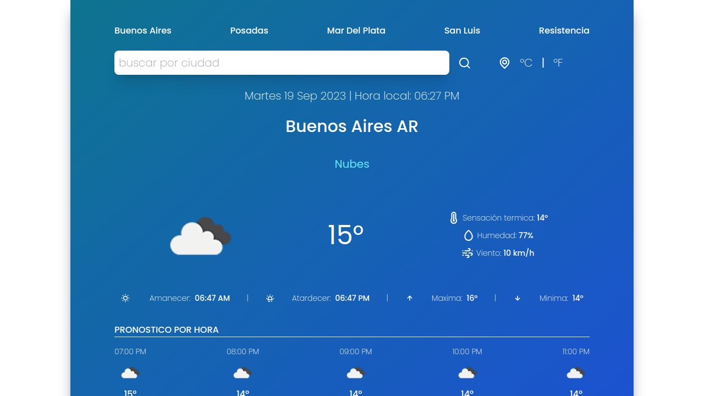
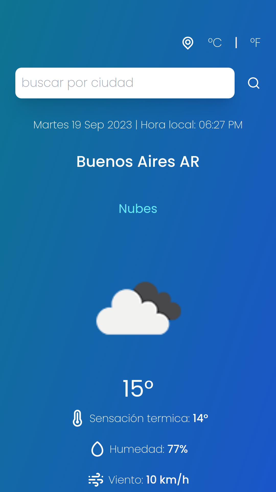

# Weather App

## Descripción

Código base de la aplicación web Weather App Hecha en React.js y Tailwind CSS que utiliza la API de Openweather.

---

## Vista En Versión Desktop

## Vista En Versión Mobile

---

## Enlace A La Aplicación

- [Weather App](https://axe10rellana-weather-app.netlify.app/)

---

## Hecho con

- [React](https://react.dev/) - JS library
- [React Toastify](https://fkhadra.github.io/react-toastify/introduction) - For notifications
- [Luxon](https://moment.github.io/luxon/#/) - For dealing with dates and times
- [Icon Scout](https://iconscout.com/unicons) - For icons
- [Tailwind CSS](https://tailwindcss.com/) - For styles

---

## Comandos

- npm i
- npm run dev
- npm run build

---

## Dependencias

- @iconscout/react-unicons
- Luxon
- React
- React Toastify
- vite-plugin-environment

## Dependencias De Desarrollo

- Autoprefixer
- Post CSS
- Tailwind CSS
- Vite

---

## Autor

- Website - [Axe10rellana](https://axe10rellana.github.io/portafolio/portafolio/)
